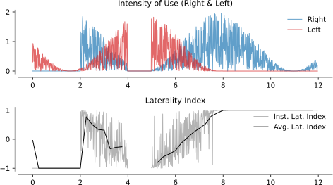

# UL Function Measures

UL use, intensity, and activity measures compute temporal signals related to how much a UL is used using raw measurements of movement-related variables. These signals can be used to compute an overall measure of how much a UL is used and the relative use of both ULs.

The detailed module documentation for `measures` can be found [here](ulmeasuresdoc).

## Overall UL Activity
The overall UL activity can be computed from the average UL activity measures[^david2021b]. This can be computed using the function `measures.Hq` in the `measures` module. 

```{code} python
>>> import numpy as np
>>> from monalysa.ulfunc import uluse
>>> from monalysa.ulfunc import ulint
>>> from monalysa.ulfunc import measures
>>> np.random.seed(0)
>>> fs = 100
>>> t = np.arange(0, 10, 1. / fs)
>>> vmag = np.square(np.sin(2 * t) + np.cos(0.4 * t) + 2) * np.random.rand(len(t))
>>> th2l, th2h = 1, 4
>>> _, _use = uluse.from_vec_mag_dblth(vmag, thresh_l=th2l, thresh_h=th2h)
>>> _, _int = ulint.from_vec_mag(vmag, _use, 1)
>>> _inxu, _avgu = uluse.average_uluse(_use, windur=0.25, winshift=0.05, fs=fs)
>>> _inxi, _avgi = ulint.average_intuse(_int, _use, windur=0.25, winshift=0.05, fs=fs)
>>> _inxa, _avga = ulint.average_ulactivity(_int, windur=0.25, winshift=0.05, fs=fs)
>>> measures.Hq(_avga, q=90)
6.128198834355528
```

## Relative UL Use
Relative UL use can be computed using either UL use, intensity of use or UL activity. Three measures are supported by the `measures` module:
1. Relative UL use measures {math}`\mathcal{R}_{q}` proposed by David et al.[^david2021b] can be computed using the function `measures.Rq`.
```{math}
    \mathcal{R}_{q} = \frac{q_{rl}}{\max \left\{ q_r^2, q_l^2\right\}}
```
Refer to David et al.[^david2021b] for more details.
2. Instantaneous laterality index computed using the asymmetry measure proposed by De Lucena et. al^[delucena2017], which can be computed at each time instant.
```{math}
    \mathcal{L}[n] = \frac{x_r[n] - x_l[n]}{x_r[n] + x_l[n]}, \,\, x_r[n] + x_l[n] \neq 0
```
where {math}`x_r[n], x_l[n]` is the UL use or instantaneous intensity of use of the right and left ULs at time instant {math}`n`, respectively. The instantaneous laterality index is computed using the function `measures.instantaneous_latindex`.

```{code} python
>>> import numpy as np
>>> from monalysa.ulfunc import uluse
>>> from monalysa.ulfunc import ulint
>>> from monalysa.ulfunc import measures
>>> np.random.seed(0)
>>> fs = 100
>>> t = np.arange(0, 12, 1. / fs)
>>> _intr = (np.sin(t) + 1) * (t > 2.0) * np.random.rand(len(t))
>>> _intr[400:500] = 0
>>> _intl = (np.sin(t - np.pi) + 1) * (t < 8.0) * np.random.rand(len(t))
>>> _intl[400:500] = 0
>>> _, _linxinst = measures.instantaneous_latindex(_intr, _intl)
>>> _inxl, _avgli = measures.average_latindex(_linxinst, windur=0.25, winshift=0.05, fs=fs)
```

Plotting the different variables from the above code snippet, we get the following figure. The bottom row shows the instantaneous laterality index in gray, and the average laterality index in black. 



When only one of the limbs is used, the laterality index is +1 or -1; when both are not used, the laterality index is undefined.

**References**
[^david2021b]: David, Ann, Tanya Subash, S. K. M. Varadhan, Alejandro Melendez-Calderon, and Sivakumar Balasubramanian. "A framework for sensor-based assessment of upper-limb functioning in hemiparesis." Frontiers in Human Neuroscience 15 (2021).
[^delucena2017]: de Lucena, Diogo S., Oliver Stoller, Justin B. Rowe, Vicky Chan, and David J. Reinkensmeyer. "Wearable sensing for rehabilitation after stroke: Bimanual jerk asymmetry encodes unique information about the variability of upper extremity recovery." In 2017 International Conference on Rehabilitation Robotics (ICORR), pp. 1603-1608. IEEE, 2017.
